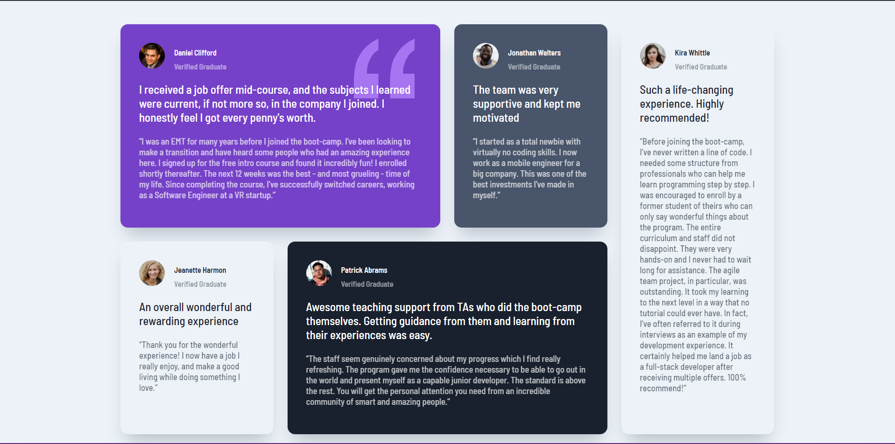

# Frontend Mentor - Testimonials grid section solution

This is a solution to the [Testimonials grid section challenge on Frontend Mentor](https://www.frontendmentor.io/challenges/testimonials-grid-section-Nnw6J7Un7). Frontend Mentor challenges help you improve your coding skills by building realistic projects.

## Table of contents

- [Overview](#overview)
    - [Screenshot](#screenshot)
    - [Links](#links)
- [My process](#my-process)
    - [Built with](#built-with)
- [Author](#author)

---

## Overview

### Screenshot

Desktop:

### Links
- [Live Site URL](https://dsaghicha-testimonials-component.netlify.app/)
- [Solution URL](https://www.frontendmentor.io/solutions/dynamic-react-testominals-section-using-css-grid-HyhPDB8Hc)

---

## My process

### Built with
- React
- SASS
- BEM CSS

---

## Author

### DSAghicha
- [Github](https://github.com/DSAghicha)
- [Frontend Mentor](https://www.frontendmentor.io/profile/DSAghicha)